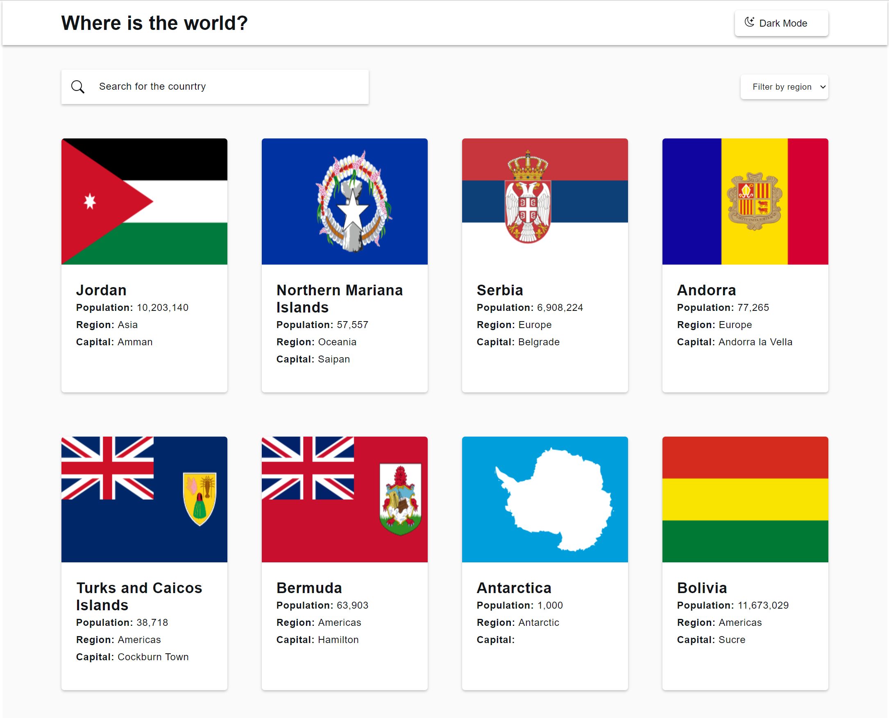
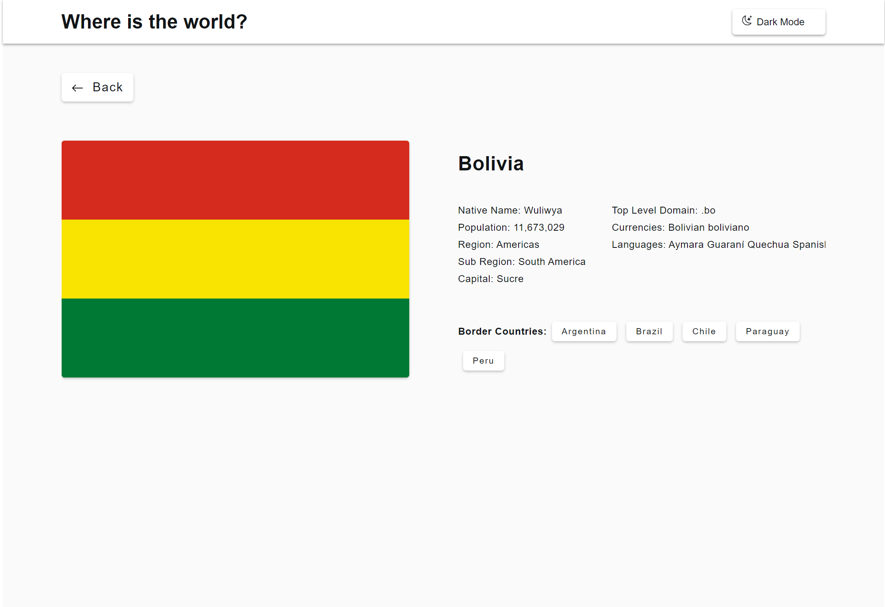

# Frontend Mentor - Intro section with dropdown navigation solution

This is a solution to the [Intro section with dropdown navigation challenge on Frontend Mentor](https://www.frontendmentor.io/challenges/intro-section-with-dropdown-navigation-ryaPetHE5). Frontend Mentor challenges help you improve your coding skills by building realistic projects.

## Table of contents

- [Overview](#overview)
  - [The challenge](#the-challenge)
  - [Screenshot](#screenshot)
  - [Links](#links)
- [My process](#my-process)
  - [Built with](#built-with)
  - [What I learned](#what-i-learned)
  - [Continued development](#continued-development)
  - [Useful resources](#useful-resources)
- [Author](#author)
- [Acknowledgments](#acknowledgments)

**Note: Delete this note and update the table of contents based on what sections you keep.**

## Overview

### The challenge

Users should be able to:

- See all the country list
- you can toggle between the light and the dark mode
- You can see the country details on the next page

### Screenshot

### Links

- Solution URL: [github repo](https://github.com/NikhilKDhande/CountryList.git)
- Live Site URL: [CountryList](https://main--loquacious-crisp-ddf498.netlify.app/)

## My process

### Built with

- Semantic HTML5 markup
- CSS custom properties
- Flexbox
- CSS Grid
- Mobile-first workflow
- [React](https://reactjs.org/) - JS library

### What I learned

In this project I learn how to interact with the API calls and represent the data in the usefull way. I also learn about the react router.

### Continued development

I want to brush-up my skill when it came to setting up the layout.
and make code simple to read and edit.

### Useful resources

- [stack over flow](https://stackoverflow.com/) - This help to get some idea to solve the problem and keep me moving forward.

## Author

- Frontend Mentor - [@NikhilKDhande](https://www.frontendmentor.io/profile/NikhilKDhande)
